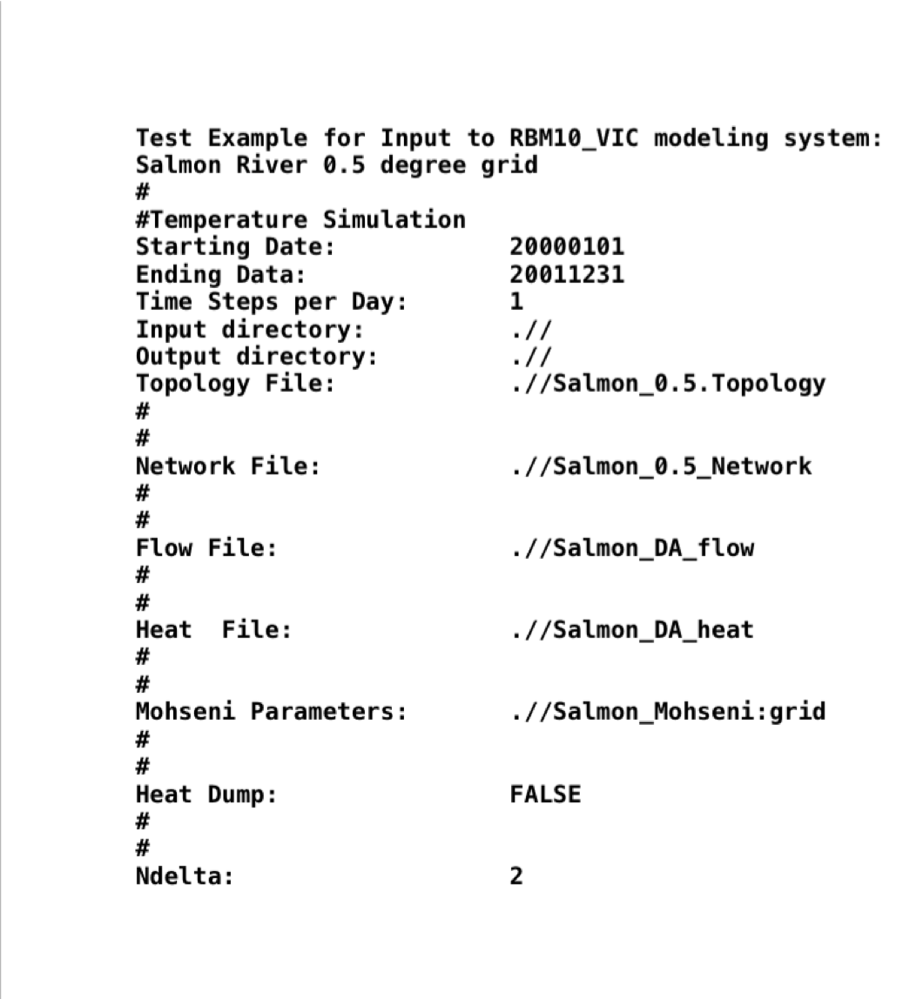
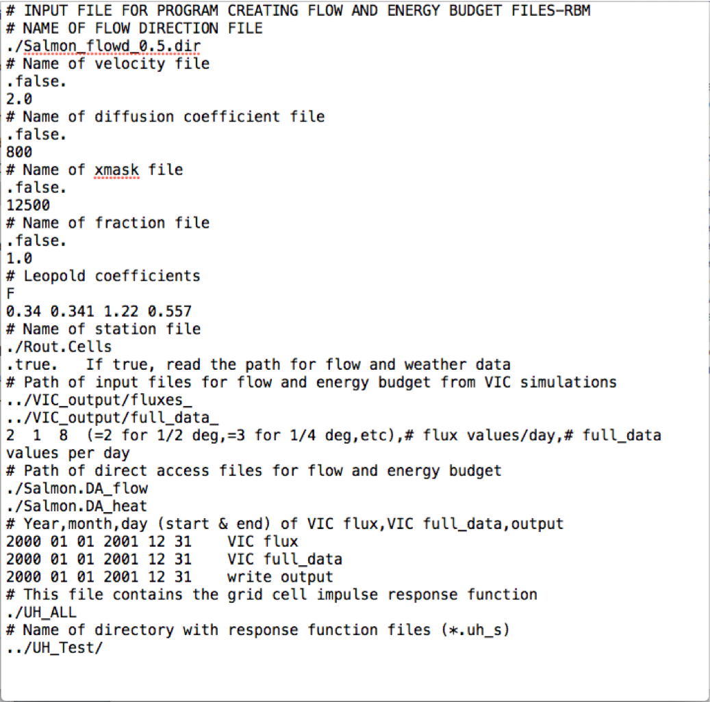

# Tutorial for Running the VIC-RBM hydrologic and stream temperature model
These are the instructions for running the integrated modeling system comprised of the large-scale hydrologic model **VIC** ([Liang et al, 1994](../Documentation/References.md)), a routing model based on the work of [Lohmann et al (1996)](../Documentation/References.md) and the semi-Lagrangian water temperature model, RBM ([Yearsley, 2009,2012](../Documentation/References.md)). Model development and implementation for the large-scale hydrologic model **VIC** are described in detail on the website of the University of Washington Department of Civil and Environmental Engineering's [UW Hydro|Computational Hydrology group](https://uw-hydro.github.io/code/)
## 1. Overview
The **VIC-RBM** model is a coupled model that links three sub-models together: the **VIC** model; the routing model; and the **RBM** model. The **VIC** model is a hydrologic model that uses meteorological forcing data as input and simulates hydrologic variables such as runoff, evapotranspiration, and soil moisture, at each grid cell. The routing model takes the output from the **VIC** model along with flow network information as input, and output streamflow at specified locations along stream network. The **RBM** model takes both the streamflow results and the meteorological data as input and calculate stream temperature along stream network. Thus, the **VIC-RBM** model as a whole is able to simulate both streamflow and stream temperature at spatial scales determined by the basic **VIC** gridded network configuration. **VIC** gridded networks have been developed for the Continental United States (CONUS) at 1/16, 1/8, 1/4, 1/2 and 1 degree of latitude and longitude. As presently configured, the **VIC-RBM** model system simulates daily-averaged or subdaily stream temperatures in accordance with the timestep of input.
## 2. Model input
### 1)Input for the VIC hydrologic model
*  Meteorological forcing data at each grid cell
    *  Minimum requirement:
        - daily precipitation
        - daily maximum and minimum temperature
        - wind speed
    *  VIC includes a meteorological data disaggregator that calculates subdaily meteorological variables required by VIC from the minimum forcing variables. Details can be seen in [VIC website](http://vic.readthedocs.io/en/develop/Documentation/Drivers/Classic/ForcingData/).
* Soil properties at each grid cell
* Vegetation information at each grid cell
### 2)Input for the routing model
*  Flow direction file – describes the topology of the river basin network.
*  Unit hydrograph file - contains the grid cell impulse response function.  

More details about input for Lohmann routing model can be seen [here](http://www.hydro.washington.edu/Lettenmaier/Models/VIC/Documentation/Routing/RoutingInput.shtml).
### 3)Input for the RBM stream temperature model
*  Mohseni parameters: Stream temperature as a function of time at headwaters is estimated using Mohseni method ([Mohseni et al., 1998](../Documentation/References.md)), a nonlinear regression of stream temperature on air temperature.
*  Stream channel geometry characteristics are required to calculate flow depth and velocity
using the method of [Leopold and Maddock (1953)](../Documentation/References.md).
## 3. Model output
Possible model output from the VIC-RBM model includes:

*  ***Grid-cell-based meteorological data*** at each grid cell at daily or subdaily time step (calculated
by the VIC model), including:
     * Precipitation
     * Air temperature
     * Wind speed
     * Atmospheric pressure and density
     * Vapor pressure (or vapor pressure deficit or relative humidity or specific humidity); Incoming shortwave (solar) radiation
     * Incoming longwave (or thermal) radiation
*  ***Grid-cell-based hydrologic data*** at each grid cell at daily or subdaily time step (calculated by the
VIC model), such as:
     * runoff
     * Snow cover
     * Soil moisture
     * Evapotranspiration
     * ... ...
*  ***Grid-cell-based energy data*** at each grid cell at daily or subdaily time step (calculated by the VIC model), such as:
     * Net downward shortwave radiation
     * Net downward longwave radiation
     * Net upward sensible heat
     * ... ...
*  ***Routed streamflow at specified stream locations***
     * (can be any locations within the stream network, and the resolution is the same as grid cell, i.e., stream locations are specified by indicating the grid cell in which it falls) calculated by the routing model, daily time step.
*  ***Stream temperature at specified stream locations***
     * calculated by the RBM model, at daily or subdaily time steps.

## APPENDIX A: RBM I/O instruction

### Notation:

**Reach**: stream reaches can include several cells

**Cell**: a cell is a grid cell.

**Cell path**: each reach is first divided into parts, which we call cell path here, based on cells; for each reach, if it covers "ncell" number of cells, then it has (ncell - 1) number of cell paths

**Node**: A cell can have one or more nodes. If a cell is not a confluence, then it has one node; if a cell is a confluence cell, then this cell has more than one node, depending on how many tributaries converge at this cell. Cell paths are the channel parts that are between two adjacent nodes.

**Segment**: a cell path is further divided into multiple segments (default is that each river cell is divided into two segments). Segment points: the division points of segments. Note that the most upstream segment point would be the upstream edge of the headwater cell.

###Example:

Some variables below are explained using the topology of the Salmon example:

####Network file (input):

    Line 1: not read

    Line 2: directory of flow file

    Line 3: directory of heat file

    Line 4: <start_date> <end_date>

            date format is "YYYYMMDD". Extra arguments will not be read.

    Line 5: <nreach> <flow_cells> <heat_cells> <source>

            <nreach>: number of reaches. A reach (Figure 1) is comprised of segments from the headwaters (circles) to the confluence with the next longest reach (squares).
                      In Figure 1, a 1st order reach is the color, magenta, a 2nd order reach is the color, chartreuse, and the longest (main stem) reach is the color, blue.
                      Note that the term, “order”, is not the same as the term used in the Strahler classification of stream order. In the example from the Salmon River, nreach = 7.

            <flow_cells>: number of total cell paths. In the example, flow_cells = 19.

            <heat_cells>: number of nodes. For non-confluence cells, each cell has one node. For confluence cells, one cell has more than one nodes (depending on how many tributaries it has).

            <source>: whether there are point source inputs. TRUE for yes, FALSE for no.

    (Line 6: <souce_file>)
            If <source>=TRUE, this line is the path of point source file.

    For each reach:

        Line 1: <no_cells> Headwaters <head_name> TribCell <trib_cell> Headwaters <main_stem> R.M. = <rmile0>

                    <no_cells>: number of nodes in the reach (at least 2)

                    <head_name>: the headwater number. Since one headwater corresponds to one reach, headwater number is also the indicator of reach number.

                    <trib_cell>: the node number in the next higher order reach where the current reach enters into. If the current reach is the highest order reach, then <trib_cell> is equal to the node number of the outlet node.

                    <main_stem>: the headwater number (thus also the reach number) of the next higher order reach it enters. If the current reach is the highest order reach, then <main_stem> is equal to 0.

                    <rmile0>: length of the reach + length of one extra grid cell upstream of the headwater cell.

        Line 2: <alphaMu> <beta> <gamma> <mu> <smooth_param>

                Mohseni parameters for this reach (alphaMu is 'alpha - mu')

        For each cell in the reach (number of loops = <no_cells>):

                Line 1: Node <node> Row <row> Column <col> Lat <lat> Long <lon> R.M. = <rmile1> <ndelta>

                        <node>: node number of this node in this reach (note that the same cell can have multiple nodes if it is a confluence cell)

                        <row>: row number of the node

                        <col>: column number of the node

                        <lat>: lat of the node

                        <lon>: lon of the node

                        <rmile1>: river length (in miles) between this node and the most downstream node of this reach (so if the current node is the most downstream node, its <rmile1> would be 0)

                        <ndelta>: number of segments of this cell in this reach (each cell reach is further diveded into <ndelta> number of segments for calculation); default: 2.

####Flow file (input):

    For each time step (currently daily):

        For each reach:

            for each cell in this reach (except the most downstream node):

                Line: <nnd> <ncell> <Q_in> <Q_out> <Q_diff> <depth> <width>

                      <nnd>: index of time step (currently daily, i.e., 1, 2, ..., last day)

                      <ncell>: node number (must be in order, and must skip the last node in each reach)

                      <Q_in>: inflow discharge of the node [cfs]

                      <Q_out>: outflow discharge of the node [cfs]

                      <Q_diff>: lateral flow directly from land surface [cfs] (usually 0 if flow is already routed)

                      depth>: flow depth [ft]

                      <width>: channel width [ft] (not used)

                      <u>: flow velocity [ft/s]

    Note: Changing line is not necessary

####Heat file (input):
    For each time step (currently daily):

        For each reach:

            for each cell in this reach (including the last cell also):

                Line: <ncell> <dbt> <ea> <Q_ns> <Q_na> <rho> <press> <wind>

                    <ncell>: node number (must be in order)

                    <dbt>: air temperature [degC]

                    <ea>: air vapor pressure at surface [mb]

                    <Q_ns>: net incoming shortwave radiation [Kcal/sec/meter**2] (see modified routing model instruction for details in units)

                    <Q_na>: net incoming longwave radiation [Kcal/sec/meter**2] (see modified routing model instruction for details in units)

                    <rho>: air density [kg/m3] (not used)

####Output file (*.Spat):
    For each divided stream segment:

        Line: <reach_ind> <cell_ind> <row> <col> <lat> <lon> <delta_ind>

            <reach_ind>: index of reach (i.e., which reach it is)

            <cell_ind>: index of node (i.e., which node in this reach it is)

            <row>: row number of the cell

            <col>: column number of the cell

            <lat>: lat of the cell

            <lon>: lon of the cell

            <delta_ind>: index of the divided segment point (i.e., which segment point in this cell and this reach it is).

    Note that the first segment point in the cell would be the upstream edge of the cell; the last segment
    point would be the last segment point upstream from the downstream edge of the cell (but not the
    downstream edge). For example, if using the default segment number = 2 for each cell, the first segment
    point would be the upstream edge of the cell; the second segment point would be the middle point of the cell.

####Output file (*.Temp):
    For each node:

        Line: <time> <nd> <nr> <ncell> <ns> <T_0> <T_head> <dbt>

            <time>: decimal year

            <nd>: day of year

            <nr>: reach index

            <ncell>: node index in this reach

            <ns>: segment index in this reach (note that it is index in this reach, but not just in this cell)

            <T_0>: stream temperature

            <T_head>: headwater temperature (should be the same for a certain reach)

            <dbt>: air temperature (should be the same for the nodes which are in the same cell)

###Figures

Figure1: Network Example

Figure2: Sample control file to run RBM for the Salmon River basin at a resolution 0.5° latitude/longitude. (Note:This example makes use of a gridded set of Mohseni parameters)

Figure3:  Input control file for running the routing model, rout. This will produce the flow and thermal energy forcings for RBM, as well as the unit hydrographs for additional simulations.

